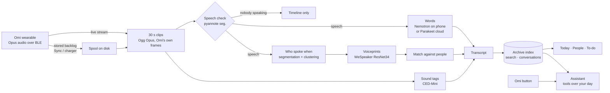

<div align="center">

# Boswell Phone

**A memory for your day, kept on your phone.**

Your [Omi](https://www.omi.me) listens. Boswell transcribes what's said, knows *who* said it,
and answers questions about it — with the speech recognition, speaker identification
and sound tagging all running on the phone itself.


</div>

---

> *James Boswell followed Samuel Johnson around London for twenty years, writing down
> what he said. This one fits in a pocket.*

Boswell Phone pairs with an Omi wearable, records the conversations around you, and turns
them into a day you can scroll, search and ask about: **who you talked with, what was
decided, what you promised.** Tap the Omi's button and ask out loud; the answer arrives
on your lock screen, or in your ear.

It is a standalone Android app — the phone-first sibling of the desktop
[Boswell](https://github.com/leakydata/boswell) project, built to be fully useful on its
own and to produce voiceprints **identical** to the desktop's, so the two archives can
one day merge.

## What it does

### 🎙️ Capture, the way you actually wear it
- **Live** — streams from the Omi over Bluetooth; conversations appear within seconds.
- **Sync** — the Omi records on its own and the phone collects its memory every so
  often, or whenever it comes into range. Easier on both batteries.
- **On the charger** — in Live mode, putting the Omi on its charger collects whatever it
  stored while you were out of range, then goes back to live.
- Recordings land **in the order they happened**, by the Omi's own clock, however late
  they download. Live capture restarts itself if Android ever stops the app.

### 📝 Transcription — on the phone, or in the cloud if you'd rather
- **NVIDIA Nemotron 3.5 ASR** runs on the phone, ~8× faster than real time.
- A **speech check** (0.6 s) skips clips nobody speaks in, before the recognizer runs.
- Optional **cloud transcription** with NVIDIA **Parakeet v3** — sending only the
  speech, never the silences — with a daily spending limit and automatic fallback to the
  phone.
- **Words Boswell should know**: names and terms it nearly gets right ("omi",
  "Bozwell") are corrected, conservatively, and can be undone.
- **Compare with the cloud** shows, word by word, where the phone and the cloud disagree.

### 🗣️ Voices — who said what
- Speaker diarization and **voiceprints compatible with desktop Boswell** (cosine
  1.0000 against the desktop on 217 speakers).
- **Teach it your voice** by reading a short passage during setup.
- **"Is this you?"** — a review of voices that are close but not certain, playing only
  that voice's words. One answer covers every recording of it, and every past recording
  is checked again.
- **Link people to your contacts**: numbers, emails and birthdays come from your phone's
  contacts, and voices get names.

### 🤖 An assistant with your day as context
Tap the Omi and ask — *"What did Sam say about the deadline?"* — or type in the app.
Answers cite the moment, and **▶ plays it**. It can:

| | |
|---|---|
| 📅 To-dos, reminders and calendar events | 🔎 Search everything that was said |
| ⏱️ Timers and alarms (rings the phone, buzzes the Omi) | 💬 Read and send texts — only with people you choose, only when you confirm |
| 🧠 Remember facts about people | 📊 Who you talked with most, and for how long |
| 🌐 Look things up on the web | 📒 Quick logs — medication, expenses, parking |
| ☎️ Pull out numbers, emails, addresses that were said | 📝 Meeting notes: summary, decisions, action items |

And it works in the background: a **morning brief**, an **evening recap**, **promises
noticed** in what was said (yours and others') filed as to-dos, and a **brief before each
meeting** from what was last said with those people.

### 🔒 Private by default
Everything is recorded, transcribed, identified and stored **on the phone**. Nothing
leaves it unless you turn on the assistant (text only) or cloud transcription — each
spelled out where you switch it on, each with its cost on an AI-usage screen. No
account, no server, no telemetry.

## How it works



- **Capture** keeps the Omi's own Opus frames as an Ogg file (no re-encoding, about a
  tenth of a WAV's size); a speech-free clip keeps only its place on the timeline.
- **Identity** follows the desktop's rules exactly: one row per voiceprint, the best row
  per person, a margin over the runner-up, and unnamed voices clustered until you name
  them.
- **The assistant** is any model on [OpenRouter](https://openrouter.ai) (your key),
  with tools over the archive and the phone. Moments are labelled `[L123]` in what it
  reads, and it cites them back so the app can play them.

## Measured, not guessed

Every number below came from a script in [`tools/`](tools) run against real recordings.

| | Result |
|---|---|
| Voiceprints vs desktop Boswell | cosine **1.0000**, same name in **217/217** cases |
| Opus decoding vs libopus | **99.85%** of samples within ±1; voiceprints 0.9999 alike |
| On-device transcription (Pixel 10 Pro XL) | **0.12×** real time on 4 threads |
| Speech check on 185 clips | **49 of 51** empty clips skipped, **no** speech missed |
| Cloud engines on the owner's own reading | Parakeet v3 **0%** errors · Nova-3 3.2% · Whisper turbo 4.7% (and invents text over noise) |
| Storage | **482 MB → 30 MB**, by keeping the Omi's own frames |
| Speech-only cloud transcription | **80%** cheaper on a mostly-quiet clip, same words and times |
| End of a spoken question | **0.8–1.6 s** after the last word (speech model, not loudness) |
| Model download | **682 → 468 MB** for the recognizer, gzip-verified on the phone |

The full story — including the dead ends — is in [`docs/DEVLOG.md`](docs/DEVLOG.md).

## Getting started

**You need:** an Android 13+ phone (arm64), an **Omi CV 1**, and — only for the
assistant or cloud transcription — an [OpenRouter](https://openrouter.ai) API key.

1. **Build and install** (see below), open Boswell, and follow the setup: permissions,
   find your Omi, choose Live or Sync, download the models (~510 MB, once), read a short
   passage so it learns your voice, and optionally add your OpenRouter key.
2. **Wear the Omi.** Conversations show up on **Today**; name the voices you know in
   **People**.
3. **Tap the Omi's button** (a quick tap — it ignores long presses) and ask a question.
   It buzzes when it hears you, and again when the answer is on your phone.

Models are **not** in the app: they download from this repository's
[`models-v1`](https://github.com/leakydata/boswell-phone/releases/tag/models-v1) release,
are checked against their SHA-256, and can be removed any time.

## Building

```bash
# JDK 21 and the Android SDK (compileSdk 37); the sherpa-onnx AAR is fetched by Gradle
JAVA_HOME=/usr/lib/jvm/java-21-openjdk-amd64 ./gradlew :app:assembleDebug
adb install -r app/build/outputs/apk/debug/app-debug.apk

./gradlew :app:testDebugUnitTest          # 70+ unit tests, no device needed
```

The measurement scripts in `tools/` are a [uv](https://docs.astral.sh/uv/) project:
`cd tools && uv run python speech_check.py …`.

## Repository

```
app/src/main/java/net/boswell/phone/
  omi/         BLE protocol: live audio, storage offload, button, haptics, clock
  capture/     the capture service, clips, battery watch, charger drain
  sync/        Live / Sync modes, spool → clips
  asr/         on-device and cloud transcription, speech-only cloud, vocabulary
  diarize/     segmentation, clustering, speech check
  speakers/    voiceprints, matching, review and re-check
  audio/       Opus decode/encode, Ogg Opus, WAV, clip storage
  archive/     the searchable index: clips, lines, conversations
  assistant/   the agent, its tools, routines, texting, alarms, contacts
  process/     the transcription worker, cleanup, clip actions
  ui/  setup/  Compose screens
tools/         measurement and release scripts (Python, uv)
docs/          DEVLOG · OMI-PROTOCOL · LESSONS · REFERENCE-CODEBASE
```

- [`docs/OMI-PROTOCOL.md`](docs/OMI-PROTOCOL.md) — the Omi's Bluetooth protocol, exact
  and hard-won.
- [`docs/LESSONS.md`](docs/LESSONS.md) — numbers measured on a real archive, and
  failures that looked like health.

## Roadmap

- A signed release build and an APK on the releases page
- Email (reading needs Google sign-in), more wearables, a desktop ↔ phone merge
- On-device Parakeet, once its contextual biasing works reliably in sherpa-onnx

## Credits

Built on [sherpa-onnx](https://github.com/k2-fsa/sherpa-onnx),
[ONNX Runtime](https://onnxruntime.ai), [Concentus](https://github.com/lostromb/concentus)
and Jetpack Compose / Media3. The models are downloaded separately, under their own
licenses:

| Model | Use | License |
|---|---|---|
| NVIDIA Nemotron 3.5 ASR (int8) | on-device transcription | OpenMDW-1.1 |
| pyannote segmentation 3.0 | speech check, who spoke when | MIT |
| WeSpeaker ResNet34-LM | voiceprints | CC-BY-4.0 |
| CED-Mini | sound tags | Apache-2.0 |
| NVIDIA Parakeet TDT 0.6B v3 *(cloud, optional)* | cloud transcription | CC-BY-4.0 |

Boswell Phone is an independent project, not affiliated with Omi / Based Hardware.

## License

[Apache License 2.0](LICENSE) — use it, change it, share it, build products on it,
commercial or not. **Credit is required:** if you distribute Boswell Phone or anything
built from it, keep the copyright notice and include the [NOTICE](NOTICE) file, which
names this project. A link back here is appreciated.

Copyright 2026 Nathan Jones ([@leakydata](https://github.com/leakydata)).
